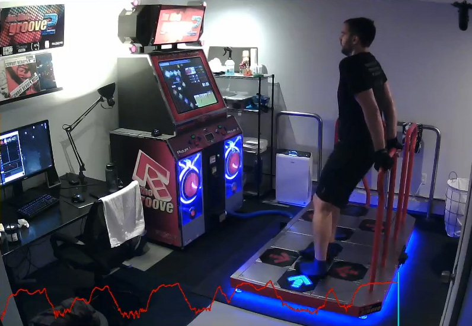

## Professional Stuff

I'm a cloud software engineer at Bose. I have a bit of experience in a lot of different areas, including back-end and front-end development, print automation, and process improvement.

- [GitHub](https://github.com/dominickp)
- [Resume](./assets/resume-web.pdf)
- [LinkedIn](https://www.linkedin.com/in/dominickpeluso/)
-  <a href="https://mailhide.io/e/v1KqrU9b" onclick="mailhidepopup=window.open('https://mailhide.io/e/v1KqrU9b','mailhidepopup','width=580,height=635'); return false;">Email me</a> 

## In The Groove

One of my favorite hobbies is playing In The Groove (ITG) which is a somewhat obscure arcade dance game from the early 2000s. I play a variant of ITG which is focused on stamina and speed as one of my workout routines.

I stream live on my [Twitch channel](https://www.twitch.tv/dom_itg) and you can find previous highlights on my [YouTube channel](https://www.youtube.com/channel/UCpeNRVOVrqx_lras7hbOOrQ) and I track my achievements on the [Groovestats leaderboard](http://groovestats.com/?page=profile&id=66762).

